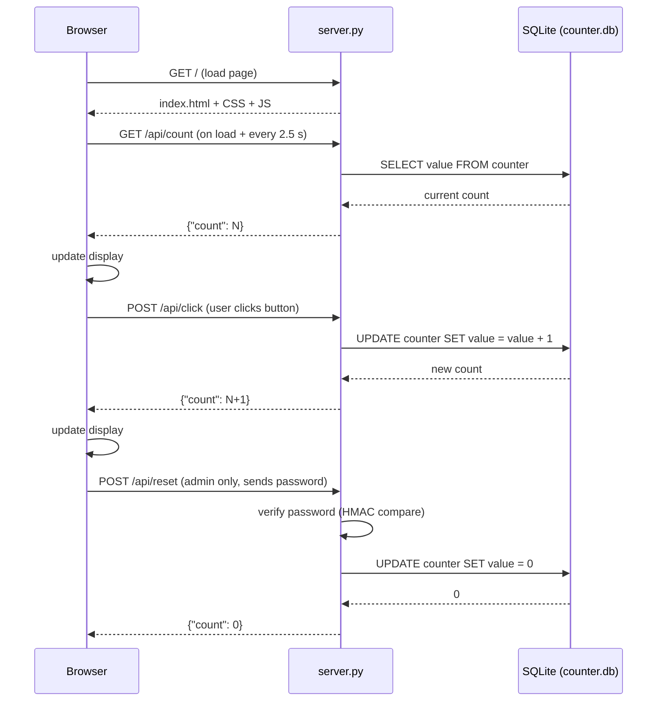

# Add Your Click

A lightweight, multi-user shared click-counter web app. Every visitor clicks the same global counter — stored on the server and updated in real time for everyone.

---

## Screenshots — Before & After

### Then — *Add Your Click* (v0.1 · 2013)


> The original 2013 version: a single-page client-side click counter with no backend, no database, and no shared state.

---

### Now — *Tasbeeh تسبيح* (v2.0 · 2026)


> Fully redesigned as a shared Tasbeeh (تسبيح) counter. Every visitor clicks the **same global count** — stored in SQLite and synced in real time across all connected devices.

---

## Host It & Share It

Because the counter is stored **on the server**, hosting this app lets anyone in the world join the same Tasbeeh session — family, friends, or an entire community can count *Subhana Allah* together, wherever they are.

- **Local network** — run `python server.py` on a computer and share your IP; everyone on the same Wi-Fi shares the count.
- **Cloud / VPS** — deploy to any Linux server (see the deployment options below) and share the URL so people worldwide can add their Tasbeeh.
- **Always-on** — set it up as a systemd service (Option 2) so the counter keeps running and accumulating even when no one is actively on the page.
- **Shareable link** — tap the **Share** button at the bottom of the page to send the URL directly to friends via your device's native share sheet or by copying it to the clipboard.

---

## How It Works

### System Architecture

```
┌─────────────────────────────────────────────────────────────────┐
│                         Web Browser                             │
│                                                                 │
│  index.html ──► css/style.css                                   │
│       │         js/script.js                                    │
│       │              │                                          │
│       │   ┌──────────▼────────────┐                            │
│       │   │   Fetch API (XHR)     │  every 2.5 s auto-sync     │
│       │   └──────────┬────────────┘                            │
└───────┼──────────────┼────────────────────────────────────────-┘
        │              │ HTTP
        │    ┌─────────▼──────────────────────────────┐
        │    │         server.py  (Python 3)           │
        │    │                                         │
        │    │  ┌─────────────────────────────────┐   │
        └───►│  │  SimpleHTTPRequestHandler       │   │
             │  │  (static files: HTML, CSS, JS)  │   │
             │  └─────────────────────────────────┘   │
             │                                         │
             │  ┌─────────────────────────────────┐   │
             │  │  REST API routes                 │   │
             │  │  GET  /api/count  → read count   │   │
             │  │  POST /api/click  → +1           │   │
             │  │  POST /api/reset  → 0 (password) │   │
             │  └──────────────┬──────────────────┘   │
             │                 │                       │
             │  ┌──────────────▼──────────────────┐   │
             │  │  SQLite  (counter.db)            │   │
             │  │  single-row counter table        │   │
             │  └─────────────────────────────────┘   │
             └─────────────────────────────────────────┘
```

### Flow Diagram



### Component Summary

| Layer | Technology | Role |
|---|---|---|
| **Frontend** | HTML5 + CSS3 + Vanilla JS | UI, click button, auto-polling |
| **Backend** | Python 3 `http.server` | Static file serving + REST API |
| **Database** | SQLite (`counter.db`) | Persistent shared counter |
| **Concurrency** | `ThreadingHTTPServer` | Handles multiple users simultaneously |
| **Security** | `hmac.compare_digest` | Timing-safe password check for reset |

---

## Project Structure

```
Add-Your-Click/
├── index.html          # Page markup
├── css/
│   └── style.css       # Responsive styling (desktop + mobile)
├── js/
│   └── script.js       # Frontend: fetch API, auto-sync every 2.5 s
├── server.py           # Python server: static files + REST API + SQLite
├── counter.db          # Auto-created on first run (SQLite database)
└── docs/               # Screenshots used in this README
```

---

## API Reference

| Method | Endpoint | Auth | Description |
|---|---|---|---|
| `GET` | `/api/count` | None | Returns `{"count": N}` |
| `POST` | `/api/click` | None | Increments counter, returns `{"count": N}` |
| `POST` | `/api/reset` | Password in JSON body | Resets counter to 0, returns `{"count": 0}` |

**Reset request body:**
```json
{ "password": "Shawareb" }
```

---

## Installation & Deployment Guide

### Requirements

- **Python 3.8+** (no third-party packages needed – all stdlib)
- The three project files: `index.html`, `css/style.css`, `js/script.js`, `server.py`

---

### Option 1 — Run Directly with Python (Development / Local Network)

```bash
# 1. Clone the repository
git clone https://github.com/shawareb/Add-Your-Click.git
cd Add-Your-Click

# 2. (Optional) set a custom reset password
export RESET_PASSWORD="MySecurePassword"   # Linux / macOS
# $env:RESET_PASSWORD="MySecurePassword"  # Windows PowerShell

# 3. Start the server
python server.py

# 4. Open in browser
#    http://127.0.0.1:4173
#    Other devices on same network: http://YOUR_LOCAL_IP:4173
```

**Custom host / port:**
```bash
APP_HOST=0.0.0.0 APP_PORT=8080 python server.py
```

---

### Option 2 — Run as a systemd Service (Linux Production)

Keep the app running after you log out and start it automatically on reboot.

```bash
# 1. Copy files to server
sudo mkdir -p /opt/add-your-click
sudo cp -r . /opt/add-your-click/

# 2. Create a dedicated user (optional but recommended)
sudo useradd --system --no-create-home clickapp

# 3. Create the service unit file
sudo tee /etc/systemd/system/add-your-click.service > /dev/null <<'EOF'
[Unit]
Description=Add Your Click counter app
After=network.target

[Service]
Type=simple
User=clickapp
WorkingDirectory=/opt/add-your-click
Environment=APP_HOST=127.0.0.1
Environment=APP_PORT=4173
Environment=RESET_PASSWORD=ChangeMe
ExecStart=/usr/bin/python3 /opt/add-your-click/server.py
Restart=always
RestartSec=5

[Install]
WantedBy=multi-user.target
EOF

# 4. Give the app user permission to write the database
sudo chown -R clickapp:clickapp /opt/add-your-click

# 5. Enable and start
sudo systemctl daemon-reload
sudo systemctl enable --now add-your-click

# 6. Check status
sudo systemctl status add-your-click
```

---

### Option 3 — Nginx Reverse Proxy (Recommended for Internet-Facing Servers)

Run `server.py` on localhost (see Option 2), then let Nginx handle HTTPS and forward traffic.

```nginx
# /etc/nginx/sites-available/add-your-click
server {
    listen 80;
    server_name clicks.example.com;

    # Redirect HTTP → HTTPS (remove this block if you don't have a certificate)
    return 301 https://$host$request_uri;
}

server {
    listen 443 ssl http2;
    server_name clicks.example.com;

    ssl_certificate     /etc/letsencrypt/live/clicks.example.com/fullchain.pem;
    ssl_certificate_key /etc/letsencrypt/live/clicks.example.com/privkey.pem;

    location / {
        proxy_pass         http://127.0.0.1:4173;
        proxy_set_header   Host $host;
        proxy_set_header   X-Real-IP $remote_addr;
        proxy_set_header   X-Forwarded-For $proxy_add_x_forwarded_for;
        proxy_set_header   X-Forwarded-Proto $scheme;
    }
}
```

```bash
# Activate and reload
sudo ln -s /etc/nginx/sites-available/add-your-click /etc/nginx/sites-enabled/
sudo nginx -t && sudo systemctl reload nginx

# Free HTTPS certificate (optional)
sudo certbot --nginx -d clicks.example.com
```

---

### Option 4 — Apache Reverse Proxy

```apache
# /etc/apache2/sites-available/add-your-click.conf
<VirtualHost *:80>
    ServerName clicks.example.com

    ProxyPreserveHost On
    ProxyPass        / http://127.0.0.1:4173/
    ProxyPassReverse / http://127.0.0.1:4173/

    ErrorLog  ${APACHE_LOG_DIR}/add-your-click-error.log
    CustomLog ${APACHE_LOG_DIR}/add-your-click-access.log combined
</VirtualHost>
```

```bash
# Enable required modules and the site
sudo a2enmod proxy proxy_http
sudo a2ensite add-your-click
sudo systemctl reload apache2

# Optional HTTPS
sudo certbot --apache -d clicks.example.com
```

---

### Option 5 — Docker

```dockerfile
# Dockerfile
FROM python:3.12-slim
WORKDIR /app
COPY . .
ENV APP_HOST=0.0.0.0
ENV APP_PORT=4173
EXPOSE 4173
CMD ["python", "server.py"]
```

```bash
# Build and run
docker build -t add-your-click .
docker run -d \
  --name add-your-click \
  -p 4173:4173 \
  -e RESET_PASSWORD=ChangeMe \
  -v "$(pwd)/counter.db:/app/counter.db" \
  add-your-click

# Open: http://localhost:4173
```

---

## Environment Variables

| Variable | Default | Description |
|---|---|---|
| `APP_HOST` | `0.0.0.0` | Address the server binds to |
| `APP_PORT` | `4173` | Port the server listens on |
| `RESET_PASSWORD` | `Shawareb` | Password required to reset the counter |

---

## Security Notes

- The reset password is checked with `hmac.compare_digest` to prevent timing attacks.
- For internet-facing deployments, **always change** `RESET_PASSWORD` via environment variable.
- Place the app behind **Nginx or Apache with HTTPS** (Options 3/4) for any public deployment.
- `counter.db` is created automatically in the project folder — ensure the server user has write access to that directory.
