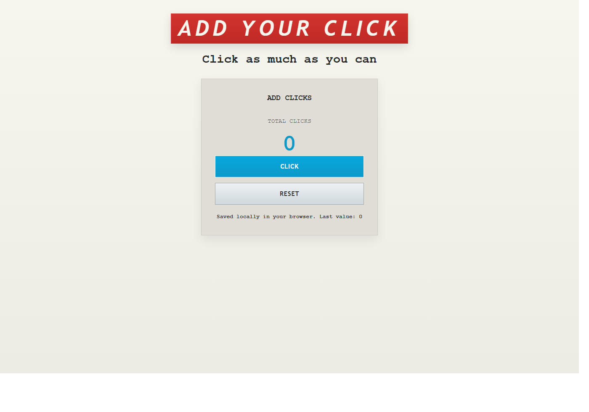
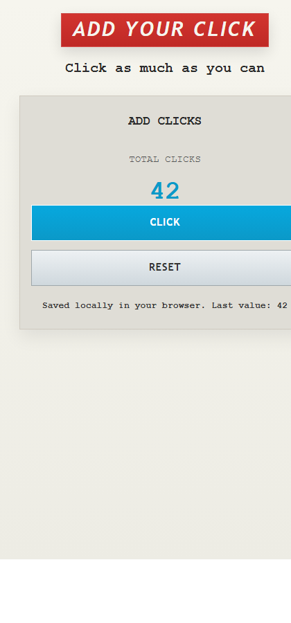

# Add Your Click

A revived version of your old project: a simple click counter website that works fully in a local browser.

## What It Does

- Shows a **total click count**.
- Increments the count every time you press **Click**.
- Saves the value in browser `localStorage` so it survives page refreshes.
- Lets you reset the counter to zero.

## Run Locally

1. Open a terminal in this project folder:
   - `C:\ShawarebCode\Add-Your-Click`
2. Start a local web server:
   - `python -m http.server 4173`
3. Open:
   - `http://127.0.0.1:4173`

You can also open `index.html` directly, but running a local server is recommended.

## Screenshots

### Desktop

### Mobile

## Extra Tip

To quickly preview with a pre-filled number, use a query string:

- `http://127.0.0.1:4173/?count=42`

This is useful for demos and screenshots.

## Project Structure

- `index.html` - page markup
- `css/style.css` - styling (desktop + mobile friendly)
- `js/script.js` - click counter logic and localStorage behavior
- `docs/` - README photos
